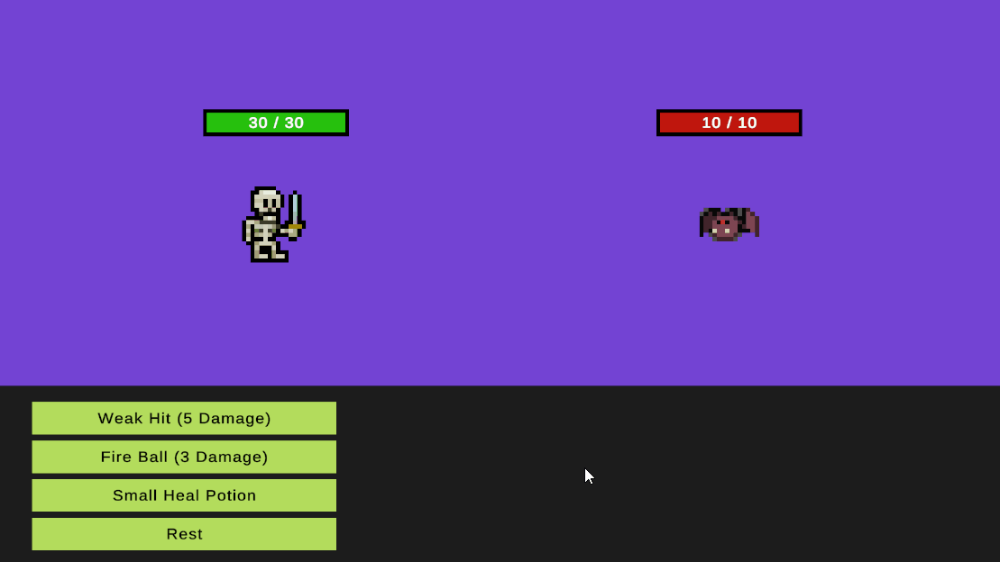

# Unity 2D Micro RPG

2D Micro Turn-based RPG prototype made with Unity 2022 LTS.

## Features

- Turn-based combat system: Characters take turns to perform actions.
- Simple AI: AI for enemy characters, which can decide to heal or attack based on their current health.
- Basic UI: Basic user interface that displays the health of characters and the available combat actions.
- Combat Actions: Different combat actions such as attack, heal, and rest.
- Health System: Characters can take damage or heal.
- Projectiles: Characters can attack with projectiles.
- Turn Manager: Controls the turn order of characters.

## Scripts

- [Character.cs](Assets/Scripts/Character.cs): Defines the character's properties and actions.
- [CombatAction.cs](Assets/Scripts/CombatAction.cs): Defines the different combat actions a character can perform.
- [CombatActionEditor.cs](Assets/Scripts/CombatActionEditor.cs): Custom editor view for the `CombatAction` class. 
- [CombatActionUI.cs](Assets/Scripts/CombatActionUI.cs): Manages the UI for combat actions.
- [TurnManager.cs](Assets/Scripts/TurnManager.cs): Manages the turn order of characters.
- [HealthBarUI.cs](Assets/Scripts/HealthBarUI.cs): Manages the UI for the character's health bar.
- [Projectile.cs](Assets/Scripts/Projectile.cs): Defines the properties and behavior of projectiles.
- [EnemyAI.cs](Assets/Scripts/EnemyAI.cs): Defines the behavior of enemy characters.

## Controls

- Click on the action buttons to perform an action.